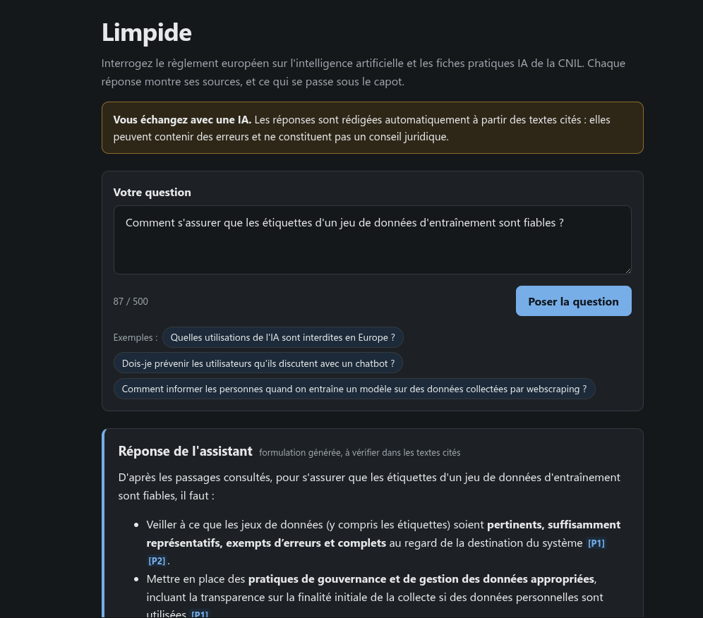
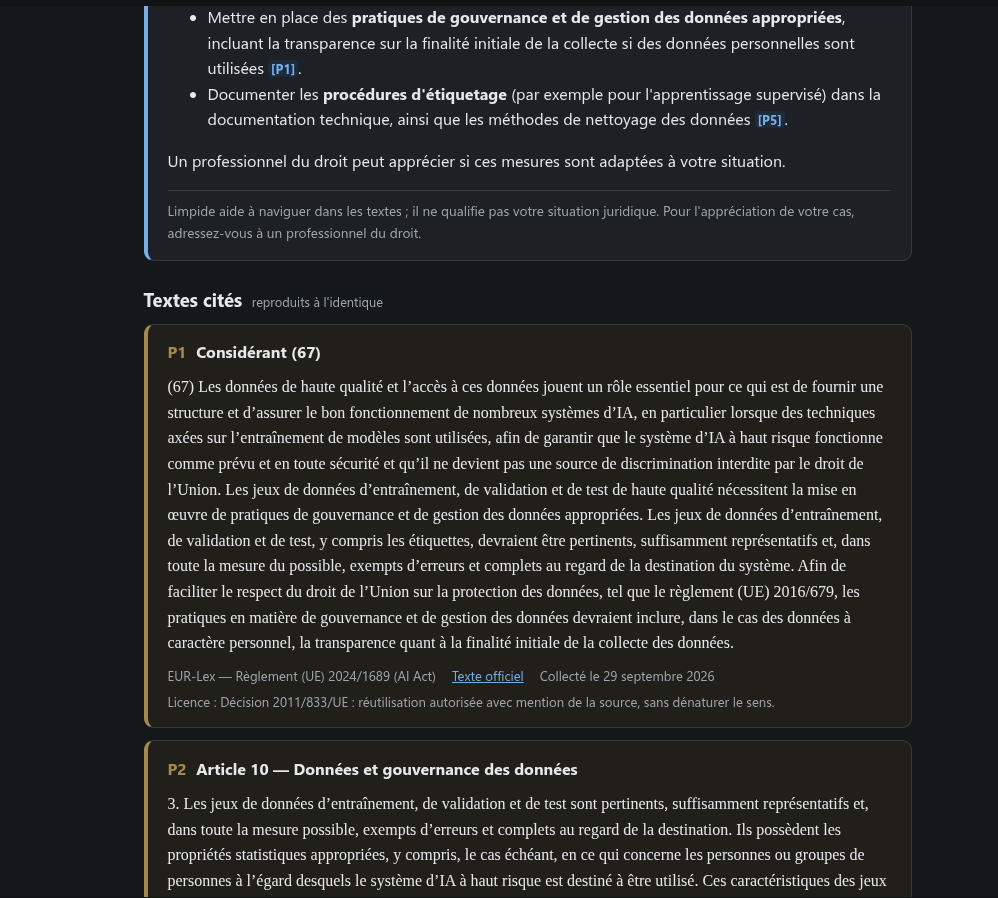
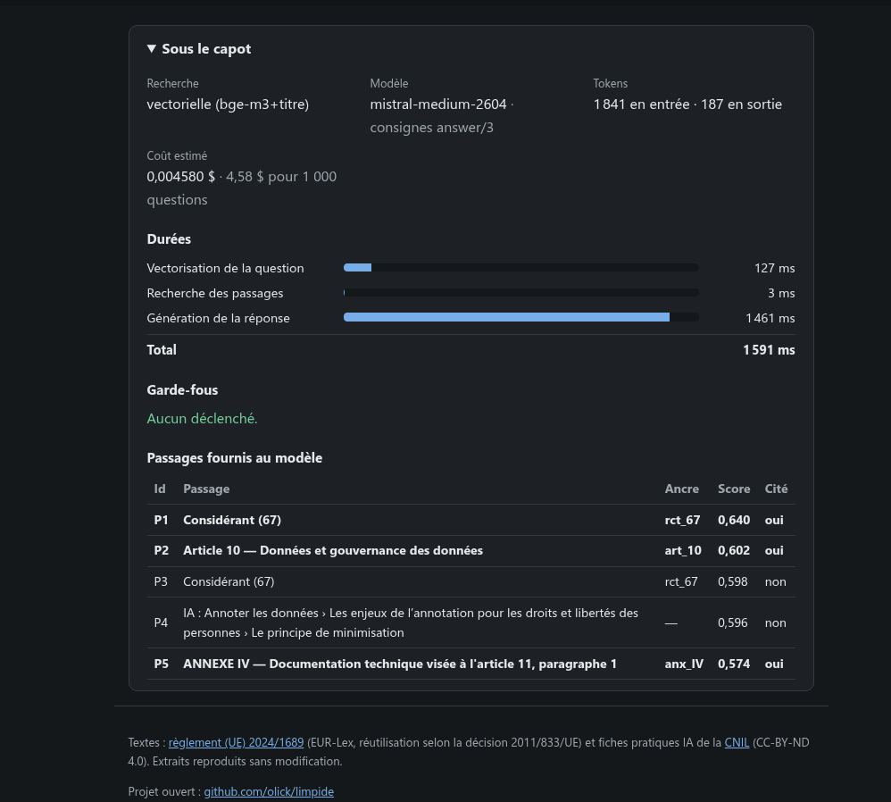

# Limpide

Assistant RAG « transparent » sur les textes publics encadrant l'IA (AI Act, recommandations CNIL).
Chaque réponse expose ce qui se passe sous le capot : sources citées, scores, stratégie de recherche,
latence, tokens, coût, garde-fous déclenchés. Une page publique affiche les résultats d'évaluation.


## Aperçu

Une question, la réponse de l'assistant (formulation générée, distincte des textes), les extraits cités
reproduits à l'identique avec leur source et leur licence, et le panneau « sous le capot ».







## Objectifs du projet

1. Une démo publique, en ligne, montrable en rendez-vous et en entretien.
2. Un passage documenté du POC à la production (Airflow, Terraform, CI/CD, observabilité).
3. Des preuves pour les 4 blocs de la RNCP41993 (gouvernance, infrastructure, pipelines, industrialisation).

## Phases

| Phase | Semaines | Résultat |
|---|---|---|
| 1 — POC de bout en bout | S1–S3 | Démo en ligne (ingestion simple .NET, pgvector, RAG, interface) |
| 2 — Industrialisation | S4–S9 | Airflow, qualité des données, Terraform/Azure, évaluation en CI, observabilité, FinOps |

Plan de la semaine en cours : [`docs/plan/semaine-01.md`](docs/plan/semaine-01.md)

## Démarrage local

```bash
cp .env.example .env
docker compose up -d
docker compose exec ollama ollama pull bge-m3
docker compose exec postgres psql -U rag -d rag -c "\dx"   # doit lister l'extension vector

# Secrets locaux (hors du dépôt) : chaîne de connexion et clé d'API Mistral
dotnet user-secrets set "ConnectionStrings:Rag" \
  "Host=localhost;Port=5432;Database=rag;Username=rag;Password=<mot de passe du .env>" \
  --project src/Limpide.Ingestion
dotnet user-secrets set "Mistral:ApiKey" "<clé>" --project src/Limpide.Ingestion
```

## Ingestion

Commandes à lancer depuis la racine du dépôt. Chacune est idempotente : la relancer ne fait rien de plus.
Sans argument, la console passe en mode interactif (invite `limpide>`, `help` pour la liste des commandes,
`exit` pour quitter) ; avec une commande, elle l'exécute puis s'arrête avec un code de sortie.
Dans VS Code : profils `Debug` et `Release` (F5), qui ouvrent le mode interactif.

```bash
dotnet run --project src/Limpide.Ingestion -- fetch     # télécharge corpus.json dans data/raw, versionne en base
dotnet run --project src/Limpide.Ingestion -- extract   # texte structuré des versions courantes dans data/extracted
dotnet run --project src/Limpide.Ingestion -- chunk     # passages dans la table chunks
dotnet run --project src/Limpide.Ingestion -- embed     # embeddings bge-m3 des passages qui n'en ont pas
dotnet run --project src/Limpide.Ingestion -- ask Quelles pratiques d\'IA sont interdites \?
dotnet run --project src/Limpide.Ingestion -- search Quelles pratiques d\'IA sont interdites \?
dotnet run --project src/Limpide.Ingestion -- evaluate  # score de la recherche sur eval/questions.json
dotnet run --project src/Limpide.Ingestion              # mode interactif
```

`data/extracted/<source>/<sha256>.json` porte le même nom que le fichier brut dont il est issu et indique la
version de l'extracteur : une nouvelle version d'extracteur relance l'extraction, sinon rien n'est refait.
De même, `chunk` redécoupe une version quand l'extracteur ou le découpeur a changé de version.

Relire 20 passages au hasard :

```bash
docker compose exec postgres psql -U rag -d rag -c \
  "SELECT char_count, heading, content FROM chunks ORDER BY random() LIMIT 20"
```

Hors poste de développement (conteneur, Airflow), la chaîne de connexion passe par la variable
d'environnement `ConnectionStrings__Rag`. Code de sortie non nul si un document n'a pas pu être collecté.

## Application web

```bash
dotnet run --project src/Limpide.Web --launch-profile http   # puis http://localhost:5181
```

Une page : la question, la réponse de l'assistant (présentée comme une formulation générée), les textes cités
reproduits à l'identique avec source, lien, date de collecte et licence, et le panneau « sous le capot »
(stratégie de recherche, modèle, durées par étape, tokens, coût, garde-fous, passages fournis et leur score).
Mêmes secrets que la console (user-secrets partagés) et mêmes réglages (`src/appsettings.shared.json`).

## Score de recherche

Recherche vectorielle seule (sans LLM), sur les 10 questions de [`eval/questions.json`](eval/questions.json) :
le passage attendu figure-t-il dans les 5 premiers résultats ? Mesuré par `evaluate`.

| Date | Texte vectorisé | 1er résultat | Top 5 | MRR |
|---|---|---|---|---|
| 2026-09-29 | texte du passage (référence) | 4/10 | 5/10 | 0,45 |
| 2026-09-29 | titre de rattachement + texte (**retenu**) | 4/10 | 8/10 | 0,55 |
| 2026-10-05 | hybride : vectorielle + plein texte, fusion RRF (écartée, ADR-005) | 3/10 | 6/10 | 0,45 |

Détail et limites de la mesure : [`docs/notes/observations-decoupage.md`](docs/notes/observations-decoupage.md).

## Structure

```
.
├── db/init/            Scripts SQL exécutés au premier démarrage de PostgreSQL
├── docs/
│   ├── adr/            Décisions d'architecture (une par fichier)
│   ├── notes/          Observations en cours, matière des futurs ADR
│   ├── plan/           Plans hebdomadaires
│   └── sources.md      Inventaire du corpus et conditions de réutilisation
├── scripts/            Scripts utilitaires (création de la solution .NET)
├── src/
│   ├── Limpide.Core            Domaine : extraction, découpage, évaluation, interfaces (sans infrastructure)
│   ├── Limpide.Infrastructure  PostgreSQL + pgvector, Ollama
│   ├── Limpide.Ingestion       Console : ingestion, recherche, évaluation, questions
│   ├── Limpide.Web             Application web (Blazor, rendu serveur)
│   └── appsettings.shared.json Réglages communs à la console et au web
├── eval/               Questions de test de la recherche
├── tests/              Tests unitaires de Limpide.Core
├── data/               Documents bruts téléchargés (ignoré par git)
└── docker-compose.yml  PostgreSQL + pgvector, Ollama
```
