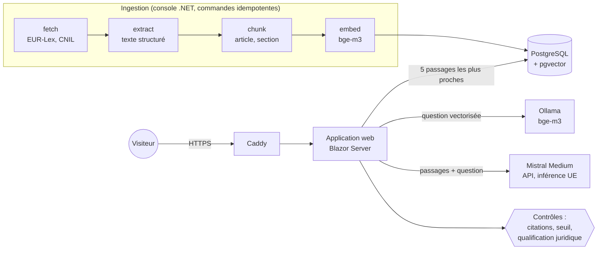

# Limpide

**Démo : [https://www.limpide-ia.fr](https://www.limpide-ia.fr)**

Assistant qui aide à naviguer dans les textes publics encadrant l'IA : le règlement européen sur l'IA (AI Act)
et les fiches pratiques IA de la CNIL. Il « joue cartes sur table » : chaque réponse cite ses sources, reproduites
à l'identique, et montre ce qui s'est passé sous le capot (passages trouvés et leur score, modèle, durées, tokens,
coût, garde-fous déclenchés).

Le sujet n'est pas d'ajouter « un RAG de plus », mais d'en montrer la **maîtrise** : choix argumentés et mesurés,
évaluation, coûts, garde-fous, gouvernance, puis industrialisation (phase 2).

## Aperçu

Une question, la réponse de l'assistant (formulation générée, distincte des textes), les extraits cités
reproduits à l'identique avec leur source et leur licence, et le panneau « sous le capot ».


## Architecture



Une question : vectorisation (bge-m3, sur le serveur) → recherche des 5 passages les plus proches (pgvector) →
si aucun n'est assez proche, « je ne sais pas » sans appeler le modèle → sinon réponse rédigée par Mistral à partir
de ces seuls passages → contrôles déterministes (citations vérifiées, qualification juridique détectée).

| Composant | Choix | Pourquoi (décision détaillée) |
|---|---|---|
| Base | PostgreSQL + pgvector | une seule base pour les données et les vecteurs ([ADR-001](docs/adr/001-pgvector.md)) |
| Embeddings | bge-m3 via Ollama, sur le serveur | multilingue, gratuit, aucune donnée ne sort ; mesuré ([ADR-002](docs/adr/002-embeddings-locaux.md)) |
| Ingestion | console .NET, une commande par étape | idempotente, reprise telle quelle par Airflow en phase 2 ([ADR-003](docs/adr/003-ingestion-phase1.md)) |
| Génération | Mistral Medium 3.5, inférence UE | retenu après mesure et relecture face à Small ([ADR-004](docs/adr/004-choix-llm.md)) |
| Recherche | vectorielle seule, seuil de pertinence | l'hybride (plein texte) mesurée moins bonne ([ADR-005](docs/adr/005-recherche-hybride.md)) |
| Hébergement | VPS OVHcloud en France, Docker Compose | ≈ 4 €/mois, sans démarrage à froid ; Azure ≈ 10 fois plus cher ([ADR-006](docs/adr/006-hebergement-demo.md)) |
| Mise à jour du corpus | une nouvelle version n'est publiée qu'une fois prête, d'un seul coup ; texte inchangé = version écartée | le document ne disparaît jamais de la recherche pendant une mise à jour ([ADR-008](docs/adr/008-cycle-de-vie-des-versions.md)) |
| Orchestration | Airflow lance les commandes .NET en conteneurs, chaque semaine | relances, alerte avec la cause, même code qu'à la main ; trois pannes testées ([ADR-007](docs/adr/007-airflow-taches-conteneurisees.md), [schéma](docs/pipeline-ingestion.md)) |

## Ce qui a été mesuré

**Recherche** (10 questions, [`eval/questions.json`](eval/questions.json)) : le passage attendu figure dans les
5 premiers résultats pour **8 questions sur 10**. Détail ci-dessous et dans
[`docs/notes/observations-decoupage.md`](docs/notes/observations-decoupage.md).

**Réponses** (15 questions : 10 réponses attendues + 5 pièges, `evaluate-answers`, rapports dans
[`eval/results/`](eval/results/)) avec Mistral Medium : 12/15 vérifiées automatiquement, 0 échec, passage attendu
cité 8/10, les 4 pièges à refuser refusés, ≈ 0,4 centime et 1 à 3 s par question. Une relecture des réponses
a trouvé ce qu'aucun contrôle automatique ne voyait (un modèle appliquant une exception hors de son domaine,
un autre tranchant la situation de l'utilisateur) : voir [`docs/notes/observations-generation.md`](docs/notes/observations-generation.md).

## Garde-fous et protections

- **Fidélité aux textes** : extraits reproduits sans modification (licences CNIL CC-BY-ND et EUR-Lex), réponse
  présentée comme une formulation de l'assistant ; citations vérifiées de façon déterministe (citation inventée,
  réponse sans citation).
- **Pas de qualification juridique** : consigne explicite et détection des phrases qui tranchent la situation
  (« votre logiciel est… ») ; avertissement fixe sur chaque réponse.
- **Hors sujet** : sous un seuil de pertinence, réponse « je ne sais pas » sans appeler le modèle (coût nul).
- **Démo publique** : 10 questions par heure et par visiteur, 60 par jour au total (≈ 9 €/mois au plus), plafond
  de dépenses chez Mistral, réponse du modèle affichée sans HTML ni liens (pas d'injection dans la page).
- **Serveur** : SSH par clé seule, pare-feu, mises à jour automatiques, seul le proxy HTTPS exposé, sauvegarde
  quotidienne de la base.

## Limites connues

Ce que la version actuelle ne fait pas encore, et qui forme le programme de la phase 2 :
[`docs/plan/bilan-phase-1.md`](docs/plan/bilan-phase-1.md).

- Corpus volontairement réduit : l'AI Act et deux fiches CNIL.
- Ingestion et déploiement lancés à la main ; pas d'évaluation automatique avant mise en ligne ; pas de supervision.
- 10 à 15 questions de test, écrites par l'auteur : mesures indicatives, pas une évaluation statistique.
- Les considérants passent parfois devant l'article qui fait foi dans les résultats.
- Un seul serveur, sans haute disponibilité ; quota de questions en mémoire.

## Phases

| Phase | Semaines | Résultat |
|---|---|---|
| 1 — POC de bout en bout | S1–S3 | **Terminée** : démo en ligne en HTTPS, choix mesurés et documentés |
| 2 — Industrialisation | S4–S9 | Airflow, qualité des données, Terraform/Azure, évaluation en CI, observabilité, FinOps, gouvernance |

Plan détaillé : [`docs/plan/plan-global.md`](docs/plan/plan-global.md).

## Démarrage local

Deux façons de faire tourner Limpide sur un poste :

| | Docker fait tourner | L'application | Adresse |
|---|---|---|---|
| **Développement** (`docker-compose.yml`) | PostgreSQL et Ollama seulement | lancée par `dotnet` (profil VS Code « Web » ou `dotnet run`) | http://localhost:5181 |
| **Production en local** (`docker-compose.prod.yml`) | tout : Caddy, application, PostgreSQL, Ollama | dans un conteneur (voir `deploy/README.md`) | http://localhost:8088 |

En développement :

```bash
cp .env.example .env
docker compose up -d
docker compose exec ollama ollama pull bge-m3
docker compose exec postgres psql -U rag -d rag -c "\dx"   # doit lister l'extension vector

# Secrets locaux (hors du dépôt) : chaîne de connexion et clé d'API Mistral
dotnet user-secrets set "ConnectionStrings:Rag" \
  "Host=localhost;Port=5432;Database=rag;Username=rag;Password=<mot de passe du .env>" \
  --project src/Limpide.Ingestion
dotnet user-secrets set "Mistral:ApiKey" "<clé>" --project src/Limpide.Ingestion
```

## Ingestion

Commandes à lancer depuis la racine du dépôt. Chacune est idempotente : la relancer ne fait rien de plus.
Sans argument, la console passe en mode interactif (invite `limpide>`, `help` pour la liste des commandes,
`exit` pour quitter) ; avec une commande, elle l'exécute puis s'arrête avec un code de sortie.
Dans VS Code : profils `Debug` et `Release` (F5), qui ouvrent le mode interactif.

```bash
dotnet run --project src/Limpide.Ingestion -- fetch     # télécharge corpus.json dans data/raw, versionne en base
dotnet run --project src/Limpide.Ingestion -- extract   # texte structuré des versions courantes dans data/extracted
dotnet run --project src/Limpide.Ingestion -- chunk     # passages dans la table chunks
dotnet run --project src/Limpide.Ingestion -- embed     # embeddings bge-m3 des passages qui n'en ont pas
dotnet run --project src/Limpide.Ingestion -- ask Quelles pratiques d\'IA sont interdites \?
dotnet run --project src/Limpide.Ingestion -- search Quelles pratiques d\'IA sont interdites \?
dotnet run --project src/Limpide.Ingestion -- evaluate  # score de la recherche sur eval/questions.json
dotnet run --project src/Limpide.Ingestion              # mode interactif
```

`data/extracted/<source>/<sha256>.json` porte le même nom que le fichier brut dont il est issu et indique la
version de l'extracteur : une nouvelle version d'extracteur relance l'extraction, sinon rien n'est refait.
De même, `chunk` redécoupe une version quand l'extracteur ou le découpeur a changé de version.

Relire 20 passages au hasard :

```bash
docker compose exec postgres psql -U rag -d rag -c \
  "SELECT char_count, heading, content FROM chunks ORDER BY random() LIMIT 20"
```

Hors poste de développement (conteneur, Airflow), la chaîne de connexion passe par la variable
d'environnement `ConnectionStrings__Rag`. Code de sortie non nul si un document n'a pas pu être collecté.

## Application web

```bash
dotnet run --project src/Limpide.Web --launch-profile http   # puis http://localhost:5181
```

Une page : la question, la réponse de l'assistant (présentée comme une formulation générée), les textes cités
reproduits à l'identique avec source, lien, date de collecte et licence, et le panneau « sous le capot »
(stratégie de recherche, modèle, durées par étape, tokens, coût, garde-fous, passages fournis et leur score).
Mêmes secrets que la console (user-secrets partagés) et mêmes réglages (`src/appsettings.shared.json`).

## Mise en ligne

Image Docker multi-étapes (`Dockerfile`), pile `docker-compose.prod.yml` (Caddy, application, PostgreSQL, Ollama),
secrets dans `.env.prod` (jamais commité). Procédure complète : [`deploy/README.md`](deploy/README.md).

## Score de recherche

Recherche vectorielle seule (sans LLM), sur les 10 questions de [`eval/questions.json`](eval/questions.json) :
le passage attendu figure-t-il dans les 5 premiers résultats ? Mesuré par `evaluate`.

| Date | Texte vectorisé | 1er résultat | Top 5 | MRR |
|---|---|---|---|---|
| 2026-09-29 | texte du passage (référence) | 4/10 | 5/10 | 0,45 |
| 2026-09-29 | titre de rattachement + texte (**retenu**) | 4/10 | 8/10 | 0,55 |
| 2026-10-05 | hybride : vectorielle + plein texte, fusion RRF (écartée, ADR-005) | 3/10 | 6/10 | 0,45 |

Détail et limites de la mesure : [`docs/notes/observations-decoupage.md`](docs/notes/observations-decoupage.md).

## Structure

```
.
├── deploy/             Mise en ligne : Caddyfile, procédure de déploiement
├── docs/
│   ├── adr/            Décisions d'architecture (une par fichier)
│   ├── notes/          Observations en cours, matière des futurs ADR
│   ├── plan/           Plans hebdomadaires
│   └── sources.md      Inventaire du corpus et conditions de réutilisation
├── scripts/            Scripts utilitaires (création de la solution .NET)
├── src/
│   ├── Limpide.Core            Domaine : extraction, découpage, évaluation, interfaces (sans infrastructure)
│   ├── Limpide.Infrastructure  PostgreSQL + pgvector, Ollama, Mistral
│   ├── Limpide.Ingestion       Console : ingestion, recherche, évaluation, questions
│   ├── Limpide.Web             Application web (Blazor, rendu serveur)
│   └── appsettings.shared.json Réglages communs à la console et au web
├── eval/               Questions de test ; rapports d'évaluation des réponses (results/)
├── tests/              Tests unitaires de Limpide.Core
├── data/               Documents bruts téléchargés (ignoré par git)
├── docker-compose.yml       Développement : PostgreSQL + pgvector, Ollama
└── docker-compose.prod.yml  Démo en ligne : Caddy, application, PostgreSQL, Ollama
```
