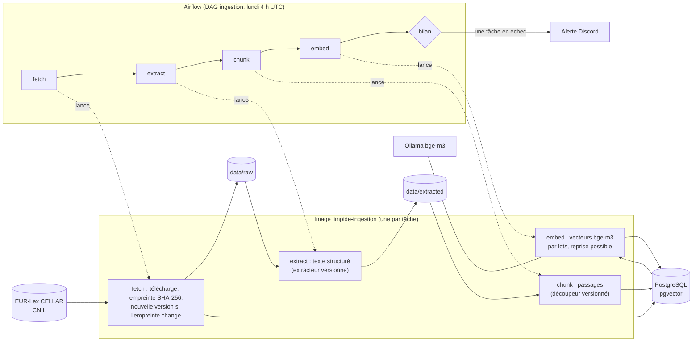

# Pipeline d'ingestion

Airflow planifie et surveille ; le travail est fait par la console .NET, une commande par conteneur (ADR-007).
Mise en place : `pipelines/airflow/README.md`.

| Élément | Rôle |
|---|---|
| Flèches pleines | données : fichiers (`data/`) et base ; jamais par Airflow |
| Flèches pointillées | Airflow lance le conteneur et lit son code de sortie et son résumé JSON (XCom) |
| `bilan` | tourne toujours ; si une tâche a échoué : une alerte, et l'exécution est marquée en échec |

**Relances** : 2 par tâche, à 5 min d'écart. Sans risque parce que chaque commande est idempotente : même
empreinte, même version d'extracteur ou de découpeur, passages déjà vectorisés = rien à refaire.

**Échec d'une étape** : les suivantes tournent quand même (`all_done`) et ne traitent que les versions cohérentes ;
un document en échec plus haut est signalé, les autres avancent.

**Limite connue (S5)** : une nouvelle version devient courante dès `fetch` ; jusqu'à la fin d'`embed`, le document
est absent de la recherche.
