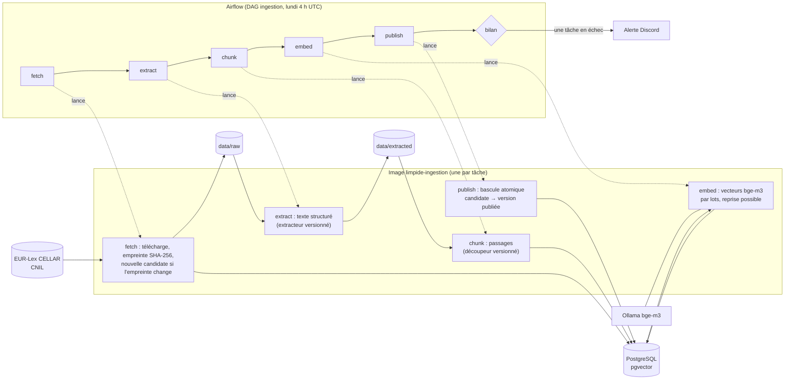
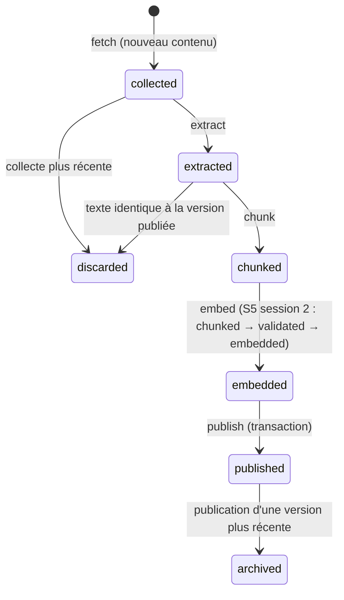

# Pipeline d'ingestion

Airflow planifie et surveille ; le travail est fait par la console .NET, une commande par conteneur (ADR-007).
Mise en place : `pipelines/airflow/README.md`.

| Élément | Rôle |
|---|---|
| Flèches pleines | données : fichiers (`data/`) et base ; jamais par Airflow |
| Flèches pointillées | Airflow lance le conteneur et lit son code de sortie et son résumé JSON (XCom) |
| `bilan` | tourne toujours ; si une tâche a échoué : une alerte, et l'exécution est marquée en échec |

**Relances** : 2 par tâche, à 5 min d'écart. Sans risque parce que chaque commande est idempotente : même
empreinte, même version d'extracteur ou de découpeur, passages déjà vectorisés = rien à refaire.

**Échec d'une étape** : les suivantes tournent quand même (`all_done`) et ne traitent que les versions cohérentes ;
un document en échec plus haut est signalé, les autres avancent.

## Cycle de vie d'une version (ADR-014)

**La recherche ne lit que la version publiée** : une candidate peut échouer à n'importe quelle étape, la version
publiée reste en service. La bascule (`publish`) est atomique : le document n'est jamais absent de la recherche.
Avant (S4) : la version devenait courante dès `fetch`, et le document disparaissait de la recherche jusqu'à la fin
d'`embed` (≈ 17 min pendant la panne d'Ollama du 2026-10-08).

**Fausses nouvelles versions** : une candidate dont le texte extrait est identique à celui de la version publiée
(pages CNIL dont seul le HTML change) est écartée dès `extract`, sans découpage ni vectorisation.
